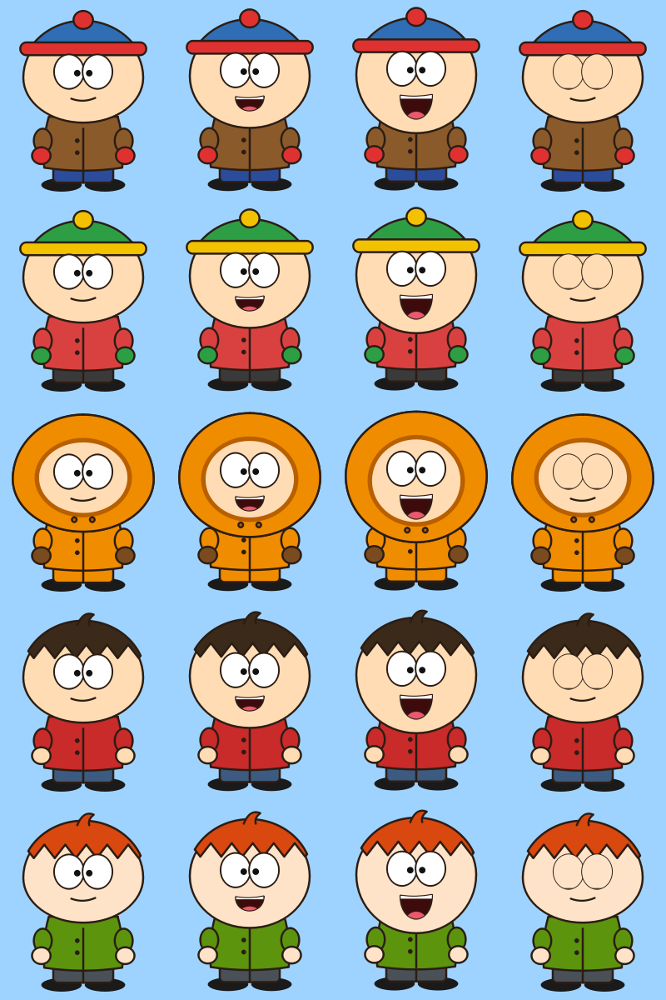
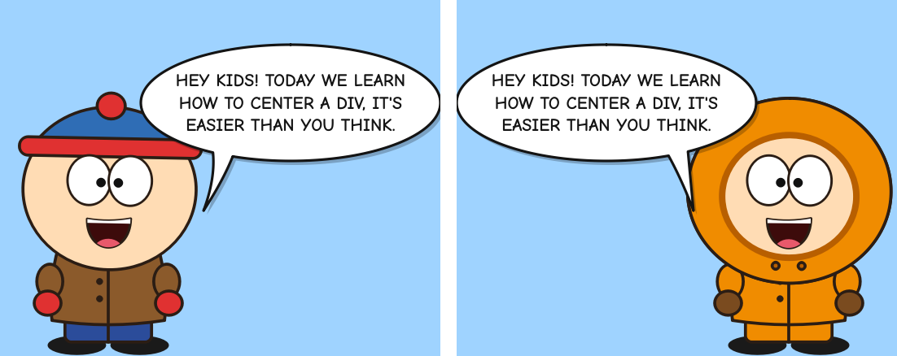
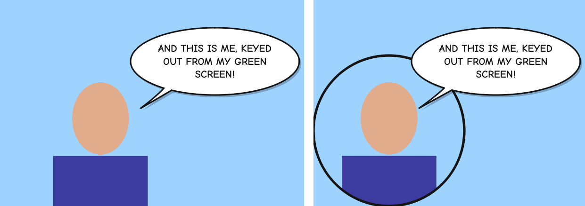
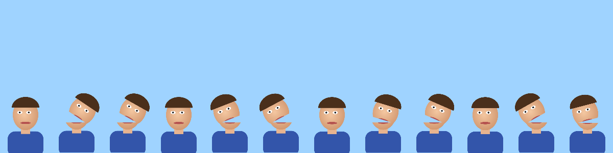

# onscreen 🎙️

A talking mascot for your tutorials and lessons, like the old on-screen
assistants but useful. It floats over your screen, always on top, and
talks when you talk.

- **Puppet mode.** A construction-paper cutout kid whose jaw flaps in sync
  with your mic. It blinks, bobs and wobbles its head while talking. Its **eyes
  follow your mouse** while you move it, and it **points at wherever you click**
  on screen. Pick one of five built-in characters or bring your own art.
- **Photo cutout, Canadian style.** Load a PNG of a person (or any photo, and
  the AI removes the background), drag the cut onto the mouth, and the whole top
  of the head flaps open and bounces around chaotically while you talk, like
  Terrance & Phillip.
- **Camera mode.** You, from the webcam, with the background removed by a
  **green screen** (chroma key with spill suppression) or by **AI** (MediaPipe
  selfie segmentation, no green screen needed). You can show the full frame,
  a circle or a rounded square.
- **Live subtitles with Whisper.** Shown in a **comic-book speech bubble** coming
  out of the mascot's mouth, or as **classic subtitles at the bottom** of the screen.
  Whisper runs locally (faster-whisper, or MLX on Apple Silicon), so nothing
  leaves your machine.

It runs natively on **macOS** and **Linux**. Windows isn't supported.






## Install

```bash
# Linux only: PortAudio for the microphone
sudo apt install libportaudio2        # or: dnf install portaudio / pacman -S portaudio

./install.sh                          # makes .venv, installs everything
.venv/bin/onscreen
```

Or install it by hand with `pip install -e ".[ai]"`. Add the `mlx` extra on
Apple Silicon for GPU Whisper, and `vcam` for virtual-camera output.

The first run downloads the Whisper model you picked. `small` is about 500 MB;
`base` and `tiny` are much smaller. The AI segmentation model (250 KB) is also
downloaded on first use. Both are cached.

**macOS:** the first time you run it, allow **Microphone** and **Camera** access
for your terminal app (System Settings → Privacy & Security). For the puppet to
point at your clicks, also allow **Input Monitoring** and **Accessibility**, then
restart it.

## Use

```bash
onscreen                               # puppet + comic bubble, control panel open
onscreen --puppet hood                 # beanie, pompom, hood, hair, redhead
onscreen --camera --bg ai              # you, background removed by AI
onscreen --camera 1 --bg chroma        # camera #1 in front of a green screen
onscreen --subs bottom --lang en       # bottom subtitles, English (default: Italian)
onscreen --model large-v3-turbo        # more accurate (needs a decent machine)
onscreen --no-point --no-follow-mouse  # puppet ignores the mouse
onscreen --list-devices                # list microphones
```

Everything is also in the **control panel**, and changes apply live. Settings
are saved to `~/.config/onscreentools/config.json` on Linux and
`~/Library/Application Support/onscreentools/` on macOS.

On the mascot itself:

| action | does |
|---|---|
| drag | move it |
| scroll wheel, `+` / `-` | resize |
| right-click | menu: puppet/camera, subtitles on/off and style, language, mouse toggles, click-through, quit |
| double-click, `P` | open the control panel |
| `M` | switch between puppet and camera |
| `S` | subtitles on/off (Whisper stays loaded, so it's instant) |
| `B` | subtitle style: comic bubble or bottom of screen |
| `E` | eyes follow the mouse: on/off |
| `F` | point at clicks: on/off |
| `C` | clear subtitles |
| `Ctrl/Cmd+Q` | quit |

**Mouse awareness** (built-in puppets): while you move the mouse, the eyes
glide toward the cursor and the head leans slightly toward it. A second after
the mouse stops, they drift back to looking straight ahead. When you click
anywhere on screen, the puppet raises the arm on that side and points at the
spot for about 1.5 seconds. Both are toggles: `E` and `F` on the mascot, the
right-click menu, the control panel, or `--no-follow-mouse` / `--no-point` at
startup. The choice is remembered. Clicks are read with a global hook
(`pynput`). On Linux that works on X11 and XWayland; native Wayland apps don't
report clicks to other programs. Photo and custom-art puppets don't follow the
mouse.

When **click-through** is on, the mascot ignores the mouse so it can sit on
top of what you're demoing. Turn it off again from the control panel or the
tray/menu-bar icon.

## Recording / streaming

- **Screen recording** (OBS, QuickTime, SimpleScreenRecorder, Kooha…): use a
  transparent background and just record the screen.
- **OBS window capture**: set the window background to green or magenta
  (`--window-bg "#00b140"`) and add a *Chroma Key* filter in OBS. Then the
  mascot becomes its own source that you can move and scale in OBS.
- **Virtual camera**: `pip install pyvirtualcam`, then `onscreen --vcam`. A
  1280×720 feed (mascot, bubble and subtitles on green) appears as a webcam in
  OBS, Zoom or Meet. It needs OBS's virtual camera on macOS, or
  `v4l2loopback` on Linux (`sudo modprobe v4l2loopback devices=1 exclusive_caps=1`).

## Photo cutout puppet (Canadian style)

```bash
onscreen --cutout ~/Pictures/me.png
```

Or click **New from PNG…** in the control panel. In the editor:

1. Drag the two **red** handles onto the mouth line, one on each side of the
   face. Everything above the line flaps.
2. **Pivot:** by default the head pivots on one end of the line or the other,
   picked at random on every syllable, so it jerks and hops from side to side.
   You can also lock it to the left or right end.
3. Set the **opening angle** and **chaos / hop** (0 is a clean flap, 2 is
   maniacal hopping). The preview on the right shows it talking; untick
   *Simulate talking* to drive it with your mic.
4. The gap under the lifted head is **see-through** by default. Tick *Dark
   mouth* to paint it with a colour. If the photo itself has no transparency,
   click **Remove background (AI)**.
5. Save. The puppet goes into `puppets/<name>` in the config folder and shows up
   in the *Character* list as "(mine)".

Works with front-facing photos as well as profiles. Crop at the chest for the
best size on screen.

## Make your own puppet

Export a built-in one as PNGs, repaint it in Krita, GIMP or Photoshop, and load
the folder:

```bash
onscreen --export-puppet beanie ~/my-puppet
onscreen --puppet ~/my-puppet
```

A puppet is a folder with a `puppet.json`. All images share one canvas size.

**Mouth frames** are the easiest option. The mouth frame is picked by loudness.

```json
{"type": "frames",
 "base": "body.png",
 "mouths": ["closed.png", "half.png", "open.png"],
 "blink": "blink.png",
 "mouth": [0.5, 0.62]}
```

`base` and `blink` are optional, and `mouth` is the position of the mouth as a
fraction of the canvas. The speech-bubble tail points at it.

**Cutout jaw** is the South Park way. The jaw slides down while you talk.

```json
{"type": "jaw",
 "back": "mouth_inside.png",
 "jaw": "jaw.png",
 "head": "head.png",
 "max_drop": 0.08,
 "mouth": [0.5, 0.62]}
```

`head.png` has the mouth area cut out. `max_drop` is a fraction of the image height.

**Canadian cutout** is what the editor writes. You can also write it by hand:

```json
{"type": "canadian",
 "image": "image.png",
 "a": [0.30, 0.55],
 "b": [0.75, 0.53],
 "pivot": "random",
 "max_angle": 28,
 "chaos": 1.0,
 "mouth_fill": false,
 "mouth_color": "#1a0505"}
```

`a` and `b` are the two ends of the mouth line, as fractions of the image.
`pivot` is `random`, `left` or `right`.

**Recolour a built-in puppet:**

```json
{"type": "builtin", "base": "beanie", "hat": "#8a2be2", "rim": "#ffd43b", "coat": "#222222"}
```

## Tuning

- **The mouth flaps on background noise:** raise the *Noise gate*.
  **It barely opens:** raise the *Sensitivity*. Watch the level meter.
- **Wrong language / gibberish:** subtitles default to **Italian**. Change the
  *Spoken language* in the control panel, in the right-click menu, or with
  `--lang en`. Avoid *Auto-detect*: Whisper guesses again on every short
  snippet and can jump to other languages mid-sentence. For better Italian, use
  a bigger model: `medium`, or `large-v3-turbo` (fast on Apple Silicon with MLX
  or on an NVIDIA GPU).
- **Subtitles lag:** use a smaller model (`base`, `tiny`, or the English-only
  `base.en`) and set the language instead of auto-detect. With an NVIDIA GPU,
  faster-whisper uses CUDA automatically. On Apple Silicon, `install.sh` adds MLX.
- **Green-screen fringe:** click *Sample corner* while the corner of the frame
  shows only the screen, then raise *Tolerance* and *Spill fix*.
- **Linux on Wayland:** Wayland doesn't let apps keep windows on top or place
  them, so onscreen runs through XWayland automatically when it's available.
  To force a platform, set `QT_QPA_PLATFORM=wayland` or `xcb`.

## How it works

```
mic ──► AudioEngine ─┬─► level ──► MouthDriver (gate + attack/release) ──► puppet jaw
                     └─► 16 kHz ─► Transcriber (Whisper) ──► SubtitleState ──► bubble / bottom bar
webcam ─► CameraSource thread ─► chroma key | MediaPipe matte ──► RGBA frame
                                         Qt overlay window, 60 fps
```

Whisper isn't a streaming model. While you talk, the utterance so far is
re-transcribed about every 0.7 s to give a live partial caption. When you pause,
one final pass with beam search commits the text.

## Develop

```bash
pip install -e ".[ai,dev]"
QT_QPA_PLATFORM=offscreen pytest
```
